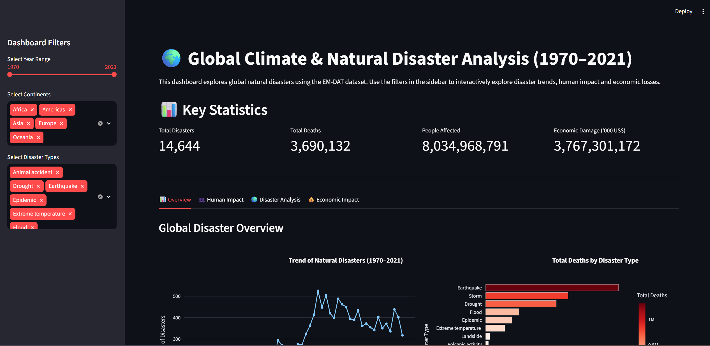
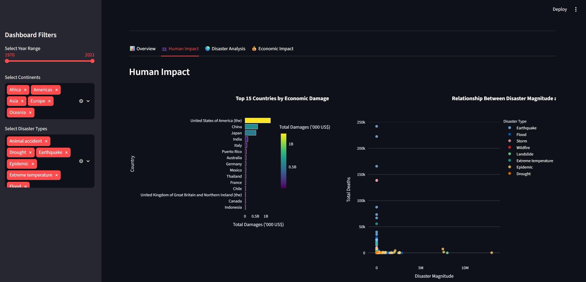
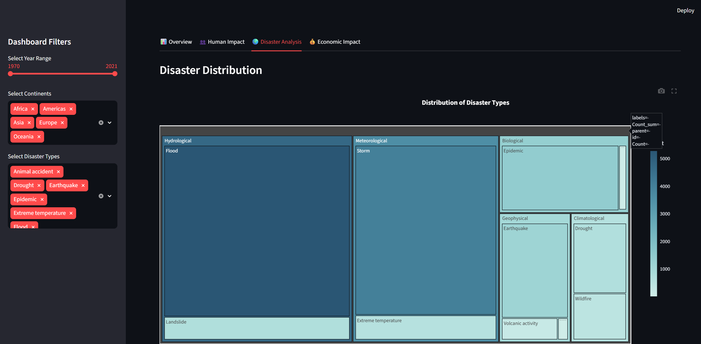
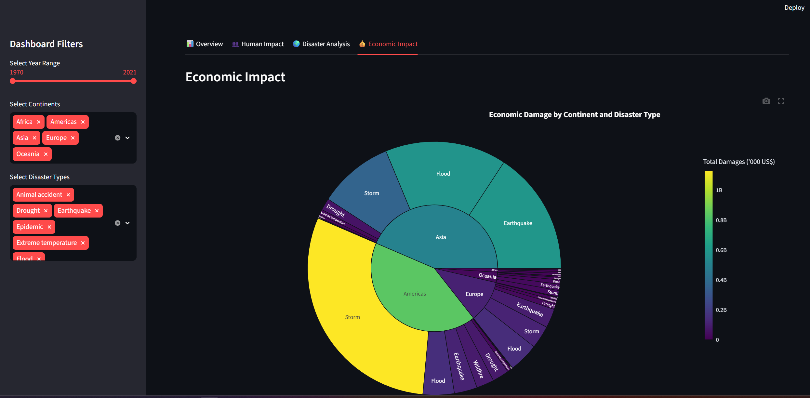

# 🌍 Global Climate & Natural Disaster Analysis (1970–2021)

## 📖 Project Overview

This project analyzes global natural disasters using the EM-DAT (Emergency Events Database) from 1970 to 2021. The objective is to identify long-term disaster trends, analyze their human and economic impacts, and present the findings through interactive visualizations and a Streamlit dashboard.

The project combines exploratory data analysis, analytical visualizations, and dashboard development to support data-driven decision-making.

---
## 🚀 Live Demo

👉 https://climatedisasteranalysis-aerwzdsvaeayvbo8ixwtaw.streamlit.app/

---

## 🎯 Objectives

- Analyze global disaster trends over time.
- Identify the most common disaster types.
- Evaluate the human impact of disasters.
- Compare economic losses across countries.
- Study seasonal patterns of disasters.
- Explore the relationship between disaster magnitude and fatalities.
- Build an interactive dashboard for data exploration.

---

## 📂 Dataset

**Dataset:** EM-DAT International Disaster Database (1970–2021)

The dataset contains worldwide records of natural disasters including:

- Disaster Type
- Disaster Subgroup
- Country
- Continent
- Start Year
- Start Month
- Total Deaths
- Total Affected
- Economic Damage
- Disaster Magnitude
- Geographic Coordinates

---

## 🛠 Technologies Used

- Python
- Pandas
- Plotly
- Streamlit
- Jupyter Notebook
- Git & GitHub

---

## 📁 Project Structure

```
Climate_Disaster_Analysis/
│
├── dashboard/
│   └── app.py
│
├── data/
│   └── raw/
│       └── emdat_disasters_1970_2021.csv
│
├── notebooks/
│   ├── 01_Data_Loading_and_Understanding.ipynb
│   ├── 02_Exploratory_Data_Analysis.ipynb
│   └── 03_Analytical_Visualizations.ipynb
│
├── images/
│
├── requirements.txt
│
└── README.md
```

---

# 📊 Analytical Questions

The project answers the following analytical questions:

1. How has the frequency of natural disasters changed over time?

2. Which disaster types have caused the highest number of deaths?

3. Which continents are most affected by disasters?

4. Which countries experience the highest economic losses?

5. Is there a relationship between disaster magnitude and fatalities?

6. Do disasters occur more frequently during specific months?

7. Which disaster subgroups contribute the most to different disaster types?

8. How does human impact compare with economic damage?

9. What are the global hotspots of natural disasters?

10. How is economic damage distributed across continents and disaster types?

---
## Dashboard Preview

### Overview



### Human Impact



### Disaster Analysis



### Economic Impact



# 📈 Dashboard Features

The Streamlit dashboard includes:

- Interactive Year Filter
- Continent Filter
- Disaster Type Filter
- KPI Cards
- 10 Interactive Plotly Visualizations
- Multi-tab Dashboard
- Responsive Layout

---

# 📊 Dashboard Visualizations

The dashboard contains:

- Disaster Trend Over Time
- Total Deaths by Disaster Type
- Human Impact by Continent
- Economic Damage by Country
- Disaster Magnitude vs Deaths
- Disaster Seasonality Heatmap
- Disaster Subgroup Treemap
- Human Impact vs Economic Damage
- Global Disaster Distribution Map
- Economic Damage Sunburst

---

# 🔍 Key Findings

- The number of natural disasters has increased significantly over time.
- Floods and storms are the most frequently occurring disasters.
- Asia experiences the greatest human impact.
- Economic losses are concentrated in a relatively small number of countries.
- Disaster magnitude does not always correspond to higher fatalities.
- Disaster occurrence varies across months and disaster categories.

---

# 🚀 How to Run

Clone the repository

```bash
git clone <repository-link>
```

Navigate to the project

```bash
cd Climate_Disaster_Analysis
```

Install dependencies

```bash
pip install -r requirements.txt
```

Run the dashboard

```bash
cd dashboard
streamlit run app.py
```

---


# 👨‍💻 Author

**Ankit Semwal**

Master of Science (Data Science)

University of Europe for Applied Sciences

Berlin, Germany

---

# 📄 License

This project is developed for academic purposes as part of the **Data Visualization** course at the University of Europe for Applied Sciences.